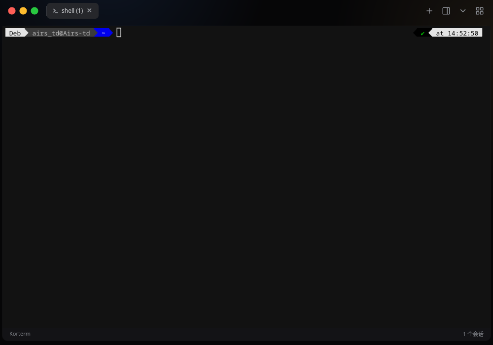
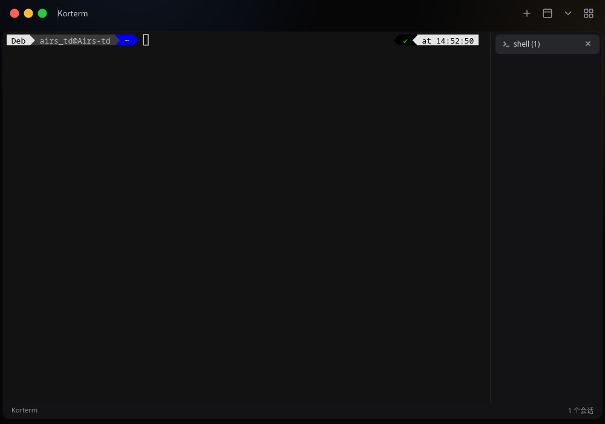
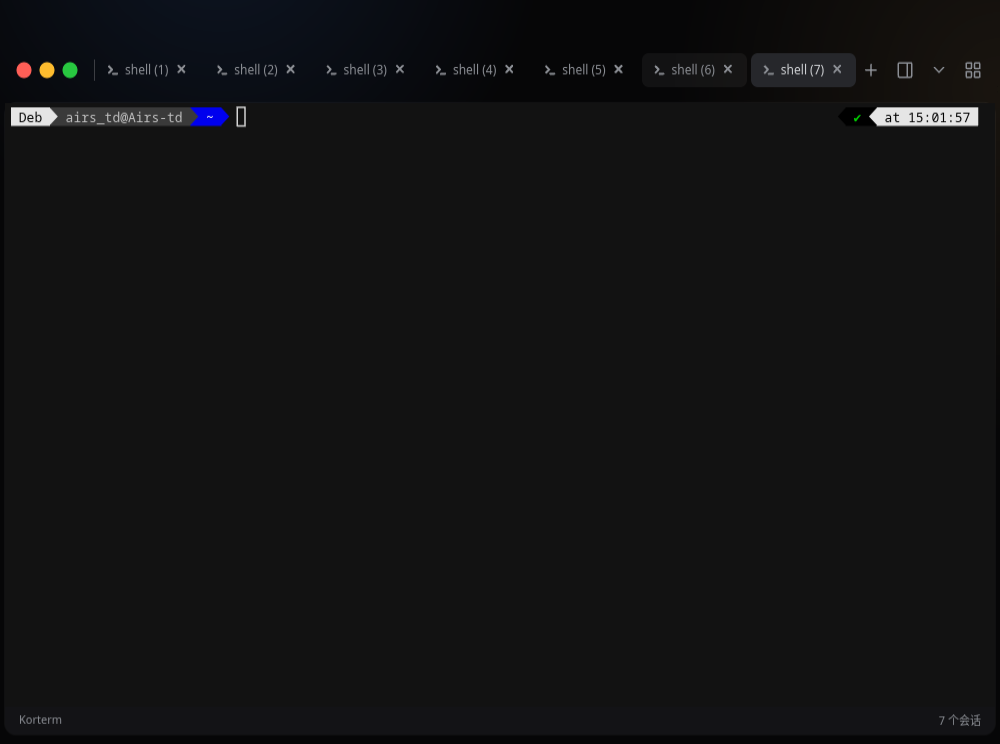

<!-- This Source Code Form is subject to the terms of the Mozilla Public
     License, v. 2.0. If a copy of the MPL was not distributed with this
     file, You can obtain one at https://mozilla.org/MPL/2.0/. -->

# Korterm

**Fleet 风格的独立终端模拟器**
技术栈:
Rust
[iced](https://github.com/iced-rs/iced)

<div align="center"></div>

## 展示
### 首次启动:
<div align="center"></div>

### 垂直侧边栏:
<div align="center"></div>

### 标签页过多时展开独立lable(用于移动窗口):
<div align="center"></div>

## 平台支持

> [!NOTE]
> Korterm 目前是 **Linux Only**(X11 / XWayland)。快捷终端依赖 X11 的窗口定位与置顶能力。

## 安装

### 从源码安装(推荐)

```bash
git clone <repo-url>
cd Korterm
./install.sh              # 构建并安装到 ~/.local
./install.sh /usr/local   # 或安装到其他前缀
./install.sh --uninstall  # 卸载
```

安装内容包括:`korterm` 可执行文件、全尺寸 hicolor 图标、`.desktop` 桌面入口。

### Debian / Ubuntu(.deb)

```bash
cargo install cargo-deb
cargo deb                 # 生成 target/debian/korterm_1.1.0-1_amd64.deb
```

### 手动构建

```bash
cargo build --release     # 产物: target/release/korterm
```

构建依赖:`libxkbcommon-dev libxkbcommon-x11-dev libwayland-dev libxcb-cursor-dev`(及常规 X11 开发库)。

## 使用

### 主程序

直接运行 `korterm`。

### 快捷终端(Quake 模式)

把桌面环境的系统快捷键绑定到:

```bash
korterm --quick
```

按一次唤出(顶部半屏、置顶、淡入),再按一次收起。首次运行会自动安装 `.desktop` 条目并引导你打开系统快捷键设置。

#### 快捷键可在设置面板中改绑。
### 默认快捷键

| 操作 | 快捷键 |
|---|---|
| 复制 / 粘贴 | `Ctrl+Shift+C` / `Ctrl+Shift+V` |
| 搜索终端 | `Ctrl+F` |
| 快速终端 | ``Ctrl+` `` |
| 新建终端 | `Ctrl+Shift+T` |
| 关闭当前终端 | `Ctrl+Shift+W` |
| 清除终端 | `Ctrl+Shift+K` |
| 下一个 / 上一个标签 | `Ctrl+Shift+→` / `Ctrl+Shift+←` |
| 打开设置 | `Ctrl+Shift+S` |


> [!NOTE]
> 终端 resize 只立即作用于当前活动标签;后台标签在你切换回去时自动补齐尺寸(vim 等全屏应用切回后自动重绘)。shell 退出时其标签会自动关闭。

## 配置

配置文件位于 `~/.config/korterm/config.conf`,格式为简单的 `key = value` 行(未知键忽略,损坏值回退默认):

```ini
statusbar_visible = true
tabs_vertical = false
sidebar_width = 180.0
shell = zsh
glow_blue = 0x4a8cff
glow_amber = 0xc99a5b
glow_intensity_top = 1.00
glow_intensity_bottom = 1.00
keybind_copy = ctrl+shift+c
```

> [!TIP]
> 旧版(`kortina-terminal`)的配置会在首次运行新版时自动迁移,无需手动处理。

## 开发

```bash
cargo check        # 快速检查
cargo test         # 运行 28 个单元测试
cargo clippy       # lint(当前零警告)
```

### 代码结构

| 模块 | 作用 |
|---|---|
| `terminal_panel.rs` | 核心状态机:会话管理、PTY 泵、输入路由、标签与菜单 |
| `quick.rs` | Quake 式快捷终端(独立进程,socket 单实例 toggle) |
| `settings.rs` | 设置面板(外观 / 辉光 / 快捷键 / 关于) |
| `titlebar.rs` | 44px 自定义标题栏与标签页 |
| `keybinds.rs` | 快捷键定义、匹配与默认键位 |
| `config.rs` | 配置持久化与旧版迁移 |
| `animation.rs` | cubic-bezier 缓动、FLIP 补间、IME 输入区 |
| `glow.rs` / `theme.rs` / `styles.rs` / `icons.rs` | 视觉层 |

终端模拟与 PTY(自研 VT 解析器)在 [`crates/terminal`](crates/terminal),矢量图标渲染在 [`crates/vector-icons`](crates/vector-icons),为方便我自己开发,将会随本仓库发布,如后续依赖项目增加会拆分仓库。

## 许可证

本项目以 [MPL-2.0](LICENSE)(Mozilla Public License v2.0)发布。


### 贡献者

感谢所有为这个项目做出贡献的开发者！

<a href=" ">
  
</a>

---

<div align="center">

### 如果这个项目对你有帮助，请给我们一颗Star！

**Made with ❤️ by Kairote Studio**
